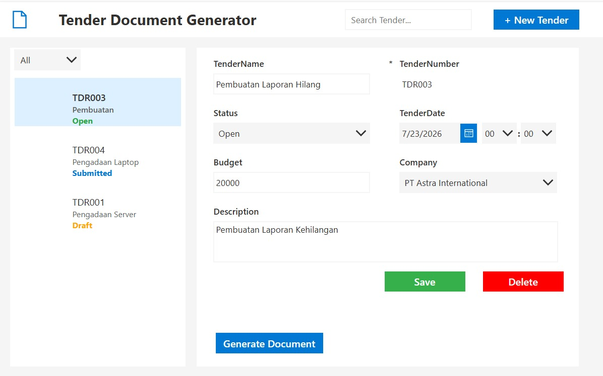
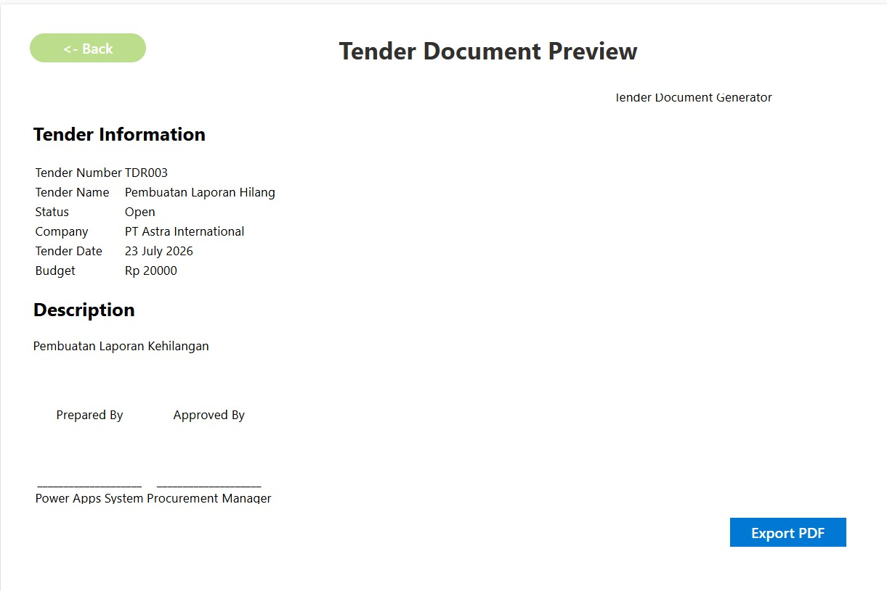
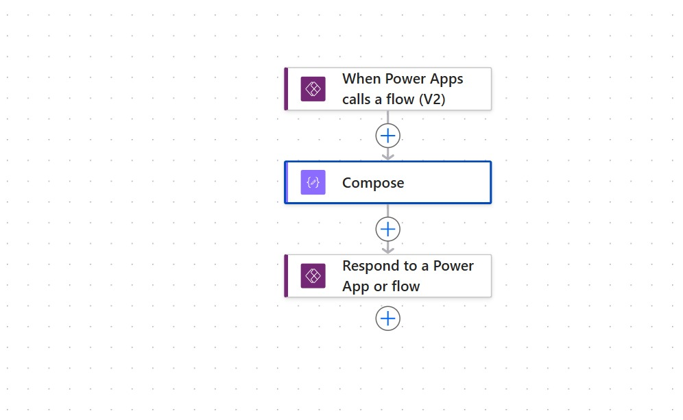

# 📄 Tender Document Generator

A Power Platform solution built with **Power Apps**, **Power Automate**, and **Dataverse** to automate tender document generation by eliminating repetitive manual copy-paste across multiple tender documents.

---

## 📌 Overview

In many organizations, preparing tender documents is still a manual process. Users have to repeatedly copy the same information (Tender Number, Company, Budget, Description, etc.) from Excel into multiple tender document templates.

This application centralizes tender information and automatically generates standardized tender documents from a single source of truth.

---

## 🚀 Features

- ✅ Tender CRUD (Create, Read, Update, Delete)
- ✅ Search Tender
- ✅ Filter Tender by Status
- ✅ Dataverse Integration
- ✅ HTML Document Preview
- ✅ Generate Tender Preview
- ✅ Export Preview to PDF
- ✅ Power Automate Integration

---

## 🛠 Technology Stack

| Technology | Description |
|------------|-------------|
| Power Apps | Canvas Application |
| Power Automate | Workflow Automation |
| Microsoft Dataverse | Data Storage |
| Power Fx | Business Logic |
| HTML & CSS | Document Template |
| PDF Function | Export Tender Document |

---

## 📷 Screenshots

### Dashboard



---
### New Tender Dashboard


---

### Tender Preview



---

### Power Automate Flow



---

## 🏗 System Architecture

```text
                User
                  │
                  ▼
          Power Apps Canvas App
                  │
                  ▼
             Microsoft Dataverse
                  │
                  ▼
          Power Automate Flow
                  │
                  ▼
          HTML Tender Document
                  │
                  ▼
             PDF Export
```

---

## 🔄 Business Workflow

### Before

```text
Excel
   │
Copy Tender Number
   │
Paste
   │
Copy Company
   │
Paste
   │
Repeat for every document
```

Preparing one tender package requires manually copying the same information into multiple document templates.

---

### After

```text
Create Tender
        │
        ▼
Save to Dataverse
        │
        ▼
Generate Tender Preview
        │
        ▼
Export PDF
```

Users only enter the information once.

---

## 📂 Project Structure

```
Tender-Document-Generator

├── exports
│   ├── Microsoft.Flow
│   ├── Microsoft.PowerApps
│   └── manifest.json
│
├── screenshots
│   ├── dashboard.png
│   ├── preview.png
│   ├── pdf.png
│   └── flow.png
│
├── docs
│
├── README.md
│
└── LICENSE
```

---

## 🎯 Business Value

This application helps organizations by:

- Reducing repetitive manual data entry.
- Eliminating copy-paste errors.
- Centralizing tender information.
- Improving document consistency.
- Accelerating tender preparation.
- Demonstrating low-code automation using Microsoft Power Platform.

---

## ⚠ Current Limitation

Currently the application generates an HTML preview and exports it as a PDF.

Automatic generation of multiple Microsoft Word templates is planned for future development and requires Microsoft 365 services such as:

- SharePoint Online
- OneDrive for Business
- Word Online (Business)

---

## 🚀 Future Enhancements

- Generate multiple tender templates automatically
- Microsoft Word Template Integration
- SharePoint Integration
- OneDrive Integration
- ZIP Package Download
- Approval Workflow
- Digital Signature
- Email Notification

---

## 👨‍💻 Author

**Refian Perdana**

LinkedIn: *https://id.linkedin.com/in/refian-perdana*

GitHub: https://github.com/refianP13

---

## ⭐ If you like this project

Please give this repository a ⭐.